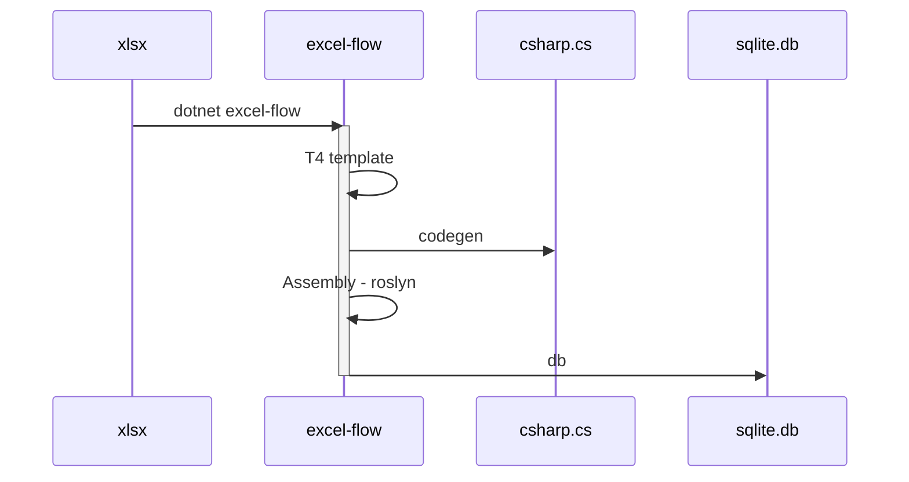

# NF.Tool.ExelFlow

## Overview

Generate code(C#) & database(sqlite) from Exel.

## Document

- [Documentation](https://netpyoung.github.io/NF.Tool.ExelFlow/)

## Dependencies

- [xoofx/Tomlyn library](https://github.com/xoofx/Tomlyn) for [Toml format](https://toml.io/en/) Config file.
- [mono/t4 library](https://github.com/mono/t4) for [T4 template](https://learn.microsoft.com/en-us/visualstudio/modeling/code-generation-and-t4-text-templates).
- [Spectre.Console.Cli](https://spectreconsole.net/cli/) for parse args.
- [SmartFormat](https://github.com/axuno/SmartFormat) for format string.
- [sqlite-net-pcl](https://github.com/praeclarum/sqlite-net) for sqlite
- [NPOI](https://github.com/nissl-lab/npoi) for exel
- [Microsoft.CodeAnalysis.CSharp](https://github.com/dotnet/roslyn) for Assembly

## License

This project is licensed under the MIT License. See the [LICENSE](https://github.com/netpyoung/NF.Tool.ExelFlow/blob/main/LICENSE.md) file for details.